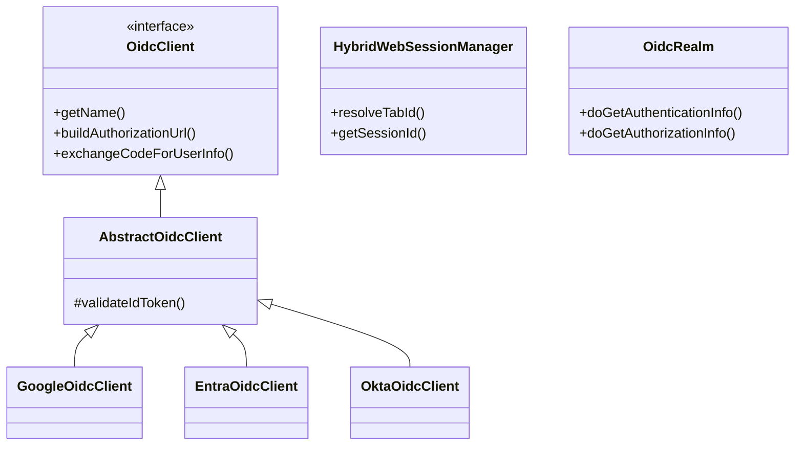

# System Architecture

This project integrates OpenID Connect (OIDC) with Apache Shiro to provide a secure, session-based web application with API support.

## 🔄 Authentication Flow (Web)

1.  **Direct Access**: User requests `/secure.html`.
2.  **Shiro Interception**: The `authc` filter detects the user is unauthenticated and redirects to `/` (Landing Page).
3.  **Provider Selection**: User clicks "Login with Google/Okta".
4.  **Initiation**: Browser hits `/portal/oidc/login?provider=google&tabId=...`.
5.  **Preparation**: `OidcLoginServlet` generates `state` and `nonce`, stores them in the session, and redirects to the IdP.
6.  **External Auth**: User authenticates at the IdP (e.g., Google).
7.  **Callback**: IdP redirects back to `/portal/oidc/callback?code=...&state=...`.
8.  **Verification**: `OidcCallbackServlet` validates the state/nonce, exchanges the code for tokens, and creates an `OidcAuthenticationToken`.
9.  **Shiro Login**: `Subject.login(token)` is called, establishing the Shiro session.
10. **Final Redirect**: User is sent back to `secure.html`.

---

## 🏗 Key Components

### Security Core
- **`OidcRealm`**: The primary Shiro Realm that accepts OIDC tokens and manages roles/permissions based on UserInfo.
- **`ApiTokenRealm`**: Validates Bearer JWTs for stateless API requests.
- **`HybridWebSessionManager`**: Custom session manager that handles multi-tab isolation by combining browser cookies with client-side `tabId`.

### OIDC Orchestration
- **`OidcClient`**: Interface for provider-specific logic (discovery, URL building, token exchange).
- **`AbstractOidcClient`**: Common logic for JWKS validation and JWT parsing.
- **`OidcClientFactory`**: Uses Java SPI to dynamically load and register OIDC providers.

### API Layer
- **`BearerAuthFilter`**: Extracts and validates JWTs from the `Authorization` header for `/api/rs/**` routes.
- **`RefreshTokenServlet`**: Provides an endpoint for clients to rotate access tokens using a valid refresh token.

---

## 🧬 Class Diagram (Conceptual)

## 🛠 Multi-Tab Strategy
The system uses a **Hybrid Session Model**:
1.  **Cookie**: A persistent `OIDC_BROWSER_ID` cookie identifies the browser instance.
2.  **Tab ID**: A unique string generated per tab (stored in `sessionStorage`) is passed in every request (`X-Tab-Id` header or `tabId` param).
3.  **Composite Session**: Shiro sessions are keyed by `browserId_tabId`.

This ensures that logging out of one provider in Tab A does not accidentally invalidate a session with a different provider in Tab B.
